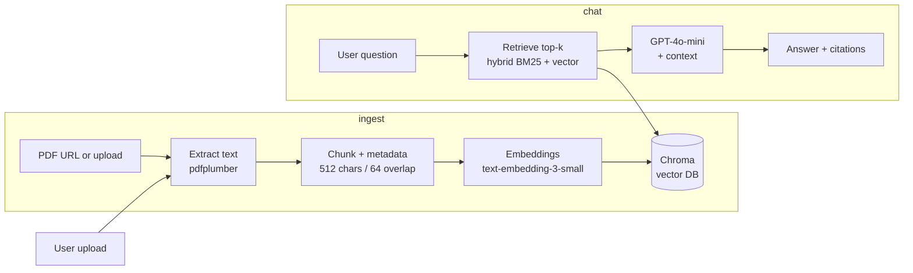

# Health Insurance RAG API

An end-to-end Retrieval-Augmented Generation (RAG) application for a U.S. health insurance knowledge base. Ingest Medicare/CMS PDFs, ask questions in a chat interface, and receive grounded answers with cited sources.

> **Disclaimer:** This is an educational demo. It does not provide medical, legal, or enrollment advice. Do not upload PHI (real SSNs, member IDs, or personal health records).

---

## Architecture



---

## Tech Stack

| Layer | Choice |
|-------|--------|
| Language | Python 3.11+ |
| API | FastAPI (port 8081) |
| RAG orchestration | LangChain |
| Embeddings | OpenAI `text-embedding-3-small` |
| LLM | OpenAI `gpt-4o-mini` |
| Vector DB | Chroma (local, persisted to `data/chroma/`) |
| Hybrid search | Dense (Chroma cosine) + Sparse (BM25) via RRF |
| PDF parsing | `pdfplumber` (primary, table-aware) + `pypdf` (fallback) |
| UI | Streamlit |
| Document registry | SQLite (`data/rag.db`) |
| Background jobs | FastAPI `BackgroundTasks` |
| Observability | LangSmith (optional) |

---

## Project Structure

```
.
├── task.md
├── README.md
├── requirements.txt
├── .env                      # OPENAI_API_KEY, LANGCHAIN_API_KEY, etc.
├── main.py                   # FastAPI entry point (port 8081)
├── streamlit_app.py          # Streamlit chat UI (port 8501)
├── app/
│   ├── database.py           # SQLite session setup
│   ├── models/
│   │   ├── document.py       # Document ORM model (status: processing/ready/failed)
│   │   └── schemas.py        # Pydantic request/response shapes
│   ├── api/
│   │   ├── documents.py      # Upload / list / delete endpoints
│   │   └── chat.py           # Chat + streaming endpoints
│   ├── ingest/
│   │   ├── parser.py         # PDF text + table extraction (pdfplumber)
│   │   ├── chunker.py        # RecursiveCharacterTextSplitter (512 chars / 64 overlap)
│   │   ├── embedder.py       # Embed chunks → Chroma (text-embedding-3-small)
│   │   └── pipeline.py       # Orchestrates parse → chunk → embed (sync + background)
│   ├── rag/
│   │   ├── retriever.py      # Hybrid BM25 + vector search (RRF fusion, confidence threshold)
│   │   └── generator.py      # GPT-4o-mini call + [Doc N] citation formatting
│   └── services/
│       ├── documentservice.py # Download / upload PDF, dedupe by SHA-256 hash
│       └── chatservice.py    # ask() + stream_ask() wrappers
├── scripts/
│   ├── seed_download.py      # Fetch CMS/Medicare PDFs into data/seed/
│   ├── generate_sample_pdf.py # Generate samples/employer-plan-summary-sample.pdf
│   └── reembed.py            # Re-embed all docs (use after changing embedding model)
├── samples/
│   └── employer-plan-summary-sample.pdf  # Synthetic plan summary for Section 4 tests
├── eval/
│   ├── questions.json        # 39 evaluation questions across 6 sections
│   ├── run_eval.py           # Automated eval script (LangSmith-traced)
│   └── results.md            # Pass/fail results (written by run_eval.py)
├── tests/
│   ├── test_api.py
│   ├── test_ingest.py
│   └── test_retriever.py
└── data/                     # Git-ignored
    ├── seed/                 # Downloaded CMS/Medicare PDFs
    ├── uploads/              # User-uploaded PDFs
    ├── chroma/               # Persisted Chroma vector DB
    └── rag.db                # SQLite document registry
```

---

## Setup

### Prerequisites

- Python 3.11+
- OpenAI API key

### Install dependencies

```bash
python -m venv venv
# Windows
venv\Scripts\activate
# macOS/Linux
source venv/bin/activate

pip install -r requirements.txt
```

### Environment variables

Add to your `.env` file in the project root:

```env
# Required
OPENAI_API_KEY=sk-...

# Optional — enables LangSmith tracing for all LangChain calls + eval runs
LANGCHAIN_TRACING_V2=true
LANGCHAIN_API_KEY=ls__...
LANGCHAIN_PROJECT=health-insurance-rag
```

---

## Running the App

### 1. Generate the sample PDF (first time only)

```bash
python scripts/generate_sample_pdf.py
```

This creates `samples/employer-plan-summary-sample.pdf` — the synthetic plan doc used for Section 4 eval tests.

### 2. Seed the knowledge base

Downloads Medicare/CMS PDFs from allowlisted URLs into `data/seed/` and indexes them:

```bash
python scripts/seed_download.py
```

### 3. Start the API

```bash
python main.py
# or: uvicorn main:app --reload --port 8081
```

API docs available at [http://localhost:8081/docs](http://localhost:8081/docs).

### 4. Start the UI (separate terminal)

```bash
streamlit run streamlit_app.py
```

UI at [http://localhost:8501](http://localhost:8501).

---

## API Endpoints

| Method | Endpoint | Description |
|--------|----------|-------------|
| `POST` | `/documents/upload-url` | Download and index a PDF from an allowlisted URL |
| `POST` | `/documents/` | Upload and index a PDF file (returns immediately; indexes in background) |
| `GET` | `/documents/` | List all documents with status (`processing` / `ready` / `failed`) |
| `DELETE` | `/documents/{doc_id}` | Remove a document and its vector chunks |
| `POST` | `/chat/` | Ask a question; returns answer + citations |
| `POST` | `/chat/stream` | Streaming chat via Server-Sent Events |

### Example: upload a file

```bash
curl -X POST http://localhost:8081/documents/ \
  -F "file=@samples/employer-plan-summary-sample.pdf"
```

### Example: chat

```bash
curl -X POST http://localhost:8081/chat/ \
  -H "Content-Type: application/json" \
  -d '{"message": "What is Medicare Part A?"}'
```

---

## Chunking & Retrieval Parameters

| Parameter | Value | Rationale |
|-----------|-------|-----------|
| Chunk size | 512 characters | Fits within embedding context; balances granularity and coherence |
| Chunk overlap | 64 characters | ~12% overlap to avoid cutting mid-sentence |
| Splitter | `RecursiveCharacterTextSplitter` | Prefers natural boundaries (`\n\n`, `\n`, `.`) |
| Top-k retrieval | 5 chunks (default) | Enough context without exceeding LLM prompt limits |
| Hybrid alpha | 0.5 (50/50) | Equal weight to BM25 and vector search |
| Confidence threshold | 0.3 (cosine similarity) | Below this → "I don't have enough information" response |

---

## Seed Documents

Only PDFs from `medicare.gov`, `cms.gov`, and `healthcare.gov` are allowlisted.

| Document | URL |
|----------|-----|
| Medicare & You handbook | medicare.gov |
| Medicare Appeals guide | medicare.gov |
| CMS Consumer Mailings Guide | cms.gov |

---

## Running Tests

```bash
pytest tests/test_api.py
pytest tests/test_ingest.py
pytest tests/test_retriever.py
```

---

## Evaluation

After indexing, run the eval suite (39 questions across 6 sections):

```bash
# Full suite
python eval/run_eval.py

# Single section
python eval/run_eval.py --section 4
```

Results are written to [eval/results.md](eval/results.md).

If `LANGCHAIN_API_KEY` is set, each question run is traced in LangSmith under the project `health-insurance-rag-eval`.

### Test sections

| Section | Topic | Questions |
|---------|-------|-----------|
| 1 | Basic retrieval (seed corpus) | 1–10 |
| 2 | Specific detail & lookup | 11–20 |
| 3 | Multi-chunk synthesis | 21–25 |
| 4 | Sample upload PDF | 26–30 |
| 5 | Safety, refusal & hallucination traps | 31–38 |
| 6 | Citation audit | 39 |

---

## Document Lifecycle

```
Upload / download
      ↓
  status: processing   ← set immediately; background task starts
      ↓
  parse → chunk → embed
      ↓
  status: ready        ← document is now searchable (~30–60 s for typical PDF)
  (or failed with error message)
```

Duplicate uploads are detected by SHA-256 content hash and returned without re-indexing.
