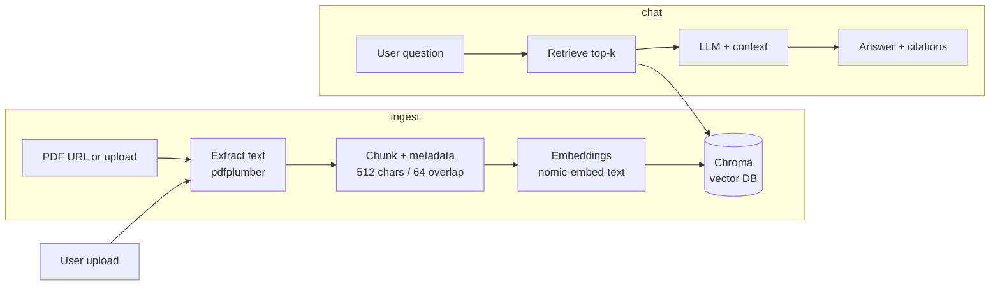

# Health Insurance RAG API

An end-to-end Retrieval-Augmented Generation (RAG) application for a U.S. health insurance knowledge base. Ingest Medicare/CMS PDFs, ask questions in a chat interface, and receive grounded answers with cited sources.

> **Disclaimer:** This is an educational demo. It does not provide medical, legal, or enrollment advice. Do not upload PHI (real SSNs, member IDs, or personal health records).

---

## Architecture



---

## Tech Stack

| Layer | Choice |
|-------|--------|
| Language | Python 3.11+ |
| API | FastAPI |
| RAG orchestration | LangChain |
| Embeddings | Ollama `nomic-embed-text` (local) |
| LLM | Ollama (local) |
| Vector DB | Chroma (local, persisted to `data/chroma/`) |
| PDF parsing | `pdfplumber` (primary) + `pypdf` (fallback) |
| UI | Streamlit |
| Document registry | SQLite |

---

## Project Structure

```
.
├── task.md
├── README.md
├── requirements.txt
├── .env
├── app/
│   ├── main.py              # FastAPI entry point
│   ├── config.py            # Settings from .env
│   ├── database.py          # SQLite session setup
│   ├── models/
│   │   ├── document.py      # Document ORM model
│   │   └── schemas.py       # Pydantic request/response shapes
│   ├── api/
│   │   ├── documents.py     # Upload / list / delete endpoints
│   │   └── chat.py          # Chat endpoint
│   ├── ingest/
│   │   ├── download.py      # Download PDF from URL or file upload
│   │   ├── parser.py        # PDF text + table extraction
│   │   ├── chunker.py       # Recursive character text splitting
│   │   ├── embedder.py      # Embed chunks → Chroma
│   │   └── pipeline.py      # Orchestrates parse → chunk → embed
│   ├── rag/
│   │   ├── retriever.py     # Vector store similarity search
│   │   ├── generator.py     # LLM call + citation formatting
│   │   └── prompt.py        # System + user prompt templates
│   └── store/
│       └── vector_store.py  # Chroma client wrapper
├── scripts/
│   └── seed_download.py     # Fetch CMS/Medicare PDFs into data/seed/
├── ui/
│   └── app.py               # Streamlit chat UI
├── eval/
│   ├── questions.json        # Evaluation question bank
│   ├── run_eval.py           # Automated eval script
│   └── results.md            # Pass/fail results
├── tests/
│   ├── test_ingest.py
│   ├── test_api.py
│   └── test_retriever.py
└── data/
    ├── seed/                 # Downloaded CMS/Medicare PDFs
    ├── uploads/              # User-uploaded PDFs
    └── chroma/               # Persisted Chroma vector DB
```

---

## Setup

### Prerequisites

- Python 3.11+
- [Ollama](https://ollama.com) running locally with the following models pulled:

```bash
ollama pull nomic-embed-text
ollama pull llama3          # or whichever LLM you configure
```

### Install dependencies

```bash
python -m venv venv
# Windows
venv\Scripts\activate
# macOS/Linux
source venv/bin/activate

pip install -r requirements.txt
```

### Environment variables

Create a `.env` file in the project root:

```env
OLLAMA_BASE_URL=http://localhost:11434
OLLAMA_LLM_MODEL=llama3
CHROMA_DIR=data/chroma
SEED_DIR=data/seed
UPLOAD_DIR=data/uploads
```

---

## Running the App

### 1. Seed the knowledge base

Downloads Medicare/CMS PDFs from allowlisted URLs into `data/seed/`:

```bash
python scripts/seed_download.py
```

### 2. Start the API

```bash
uvicorn app.main:app --reload
```

API docs available at [http://localhost:8000/docs](http://localhost:8000/docs).

### 3. Start the UI

```bash
streamlit run ui/app.py
```

---

## API Endpoints

| Method | Endpoint | Description |
|--------|----------|-------------|
| `POST` | `/documents/upload-url` | Download and index a PDF from a URL |
| `POST` | `/documents/upload` | Upload and index a PDF file |
| `GET` | `/documents` | List all documents with status |
| `DELETE` | `/documents/{doc_id}` | Remove a document and its vector chunks |
| `POST` | `/chat` | Ask a question; returns answer + citations |

### Example: upload by URL

```bash
curl -X POST http://localhost:8000/documents/upload-url \
  -H "Content-Type: application/json" \
  -d '{"url": "https://www.medicare.gov/publications/10050-le-medicare-and-you.pdf"}'
```

### Example: chat

```bash
curl -X POST http://localhost:8000/chat \
  -H "Content-Type: application/json" \
  -d '{"message": "What is Medicare Part A?"}'
```

---

## Chunking & Retrieval Parameters

| Parameter | Value | Rationale |
|-----------|-------|-----------|
| Chunk size | 512 characters | Fits within embedding context; balances granularity and coherence |
| Chunk overlap | 64 characters | ~12% overlap to avoid cutting mid-sentence |
| Splitter | `RecursiveCharacterTextSplitter` | Prefers natural boundaries (`\n\n`, `\n`, `.`) |
| Top-k retrieval | 5 chunks | Enough context without exceeding LLM prompt limits |
| Score threshold | 0.7 (cosine similarity) | Below this → "not enough information" response |

---

## Seed Documents

| Document | Source |
|----------|--------|
| Medicare & You handbook | medicare.gov |
| CMS Consumer Mailings Guide | cms.gov |

Only PDFs from `medicare.gov`, `cms.gov`, and `healthcare.gov` are allowlisted for seed ingestion.

---

## Running Tests

```bash
# Ingest pipeline test (requires Ollama running)
python tests/test_ingest.py

# API tests
pytest tests/test_api.py

# Retriever tests
pytest tests/test_retriever.py
```

---

## Evaluation

After indexing, run the eval suite against the question bank:

```bash
python eval/run_eval.py
```

Results are recorded in [eval/results.md](eval/results.md). The suite covers:

- Section 1–2: Basic retrieval and specific detail lookups (seed corpus)
- Section 3: Multi-chunk synthesis questions
- Section 4: Sample employer plan PDF upload and query
- Section 5: Safety, refusal, and hallucination traps
- Section 6: Citation audit
